# Revised Versions
Tableau Public Versions at:
https://public.tableau.com/profile/sydney.akers#!/vizhome/GunControlRevisedVersions/MoreGunsMoreSuicides

## Redesign Versions

### Chart #11 from Vox's gun violence article    
https://www.vox.com/policy-and-politics/2017/10/2/16399418/us-gun-violence-statistics-maps-charts

Original: 
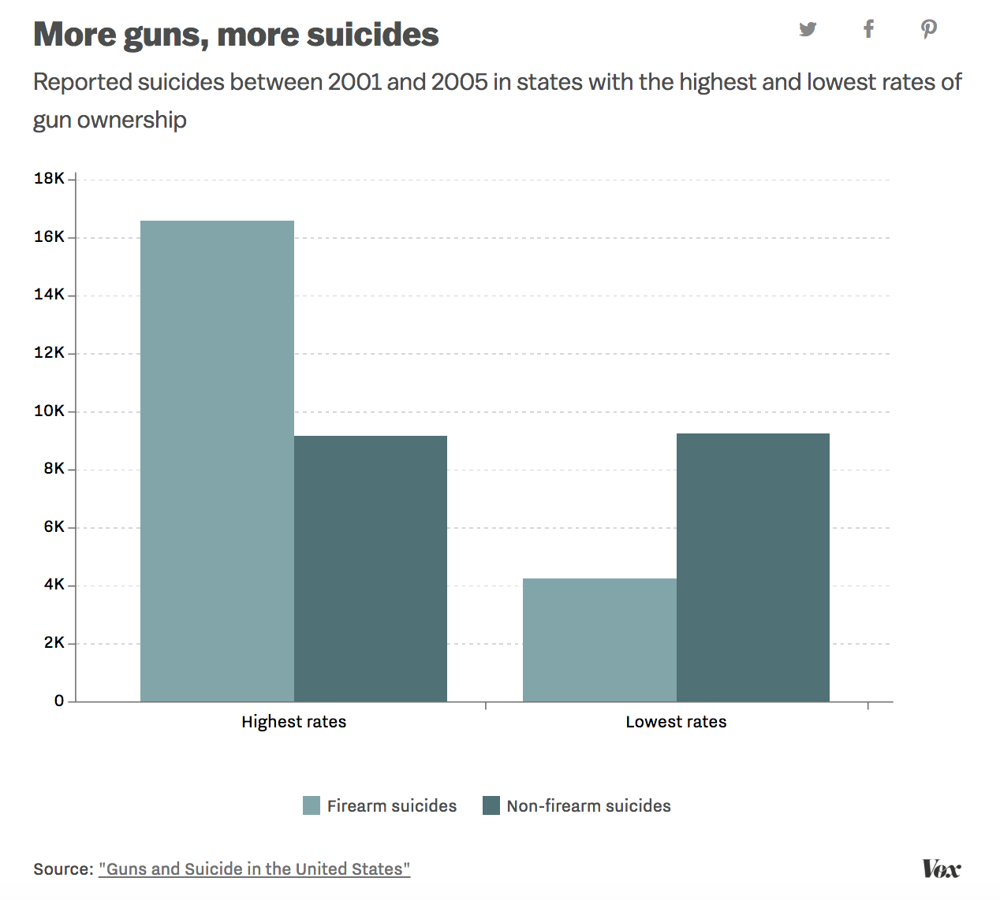

First Version: 
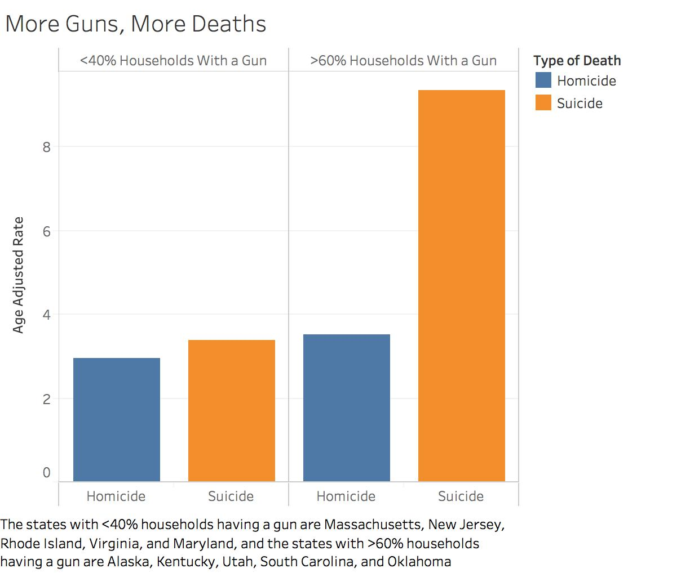

Revised Version:
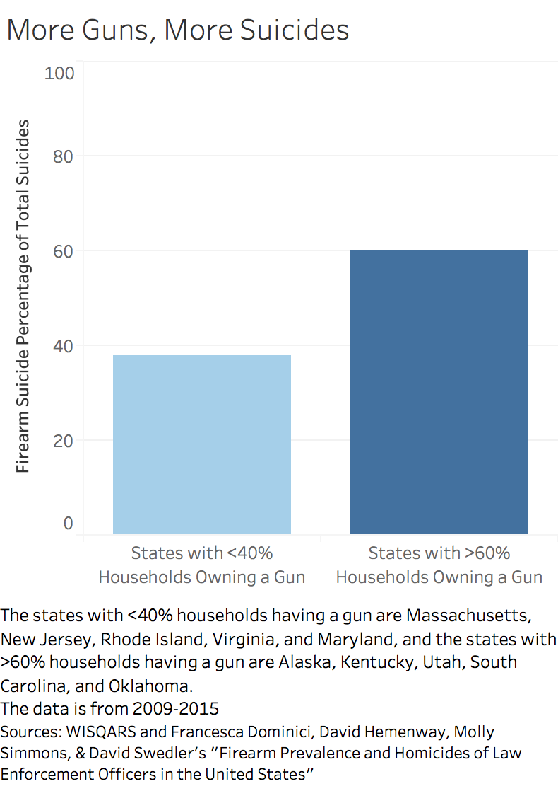

#### Critique of First Version
My first version corrected a few ambiguities in the original, but created some of its own. "Age Adjusted Rate," as I postulated in my intended improvements, was confusing to general audiences. Secondly, my first version made its rebuttal rather easy, since the homicide rates were not drastically different. Furthermore, a second criticism could be that firearm suicides could have been higher in states with more guns simply because there are more suicides in that state (due to some other factor). 

So I decided to correct all of these by scrapping the homicide data since it did not support my argument, and focusing on the suicide data. I decided to show firearm suicides as a percentage of all suicides in each group of states, to more clearly show the correlation between having more households with guns, and a larger portion of firearm suicides. 

For polish, I changed the jarring Tableau default colors to different shades of blue (distinguishable in black and white) and added source information. 

#### Additional Necessary Data Wrangling
Sources used in the first version:
https://ajph.aphapublications.org/doi/full/10.2105/AJPH.2015.302749 
https://wisqars.cdc.gov:8443/nvdrs/nvdrsDisplay.jsp
I revisited the WISQARS data ( https://wisqars.cdc.gov:8443/nvdrs/nvdrsDisplay.jsp) to obtain data on total suicides (all methods) in each group of states as before. 

Below are my input options for the WISQARS report options to obtain the additional "total suicides" data:
1. Select a report type. (Select only one button from the eight options below.)
- I selected Violent Death Counts, and from the  Deaths and Rates,  I selected Age-adjusted
Rates, Crude Rates and Death Counts with 2000 as the standard year.
2. What was the intent or manner of the injury based on the abstractor-assigned manner of death? (Select one or more boxes.)
- I selected suicide.
3. Specify the relationship of victim to suspect. (When applicable)
- It wouldn’t let me select “all” so I assume it wasn’t applicable.
4. What was the cause or mechanism of the injury based on the abstractor-assigned manner of death? (Select one or more boxes.)
- I selected Standard Injury Mortality Cause Groupings selected all.
5. Select specific options. (Make multiple selections by dragging mouse or by holding down "control" [Ctrl] key.)
  
- I selected years 2009-2015, and either [Alaska, Kentucky, Utah, South Carolina, and Oklahoma] or [Massachusetts, New Jersey, Rhode Island, Virginia, and Maryland] depending on the information I wanted. I selected all races, all ethnicities and both sexes.
Select Age Group
- I selected all age groups.

#### Tableau Revisions

I changed the title back to "More Guns, More Suicides." With the new data, I put "SUM(Firearm suicide percentage of total suicides)" on the rows. 
I edited the y-axis title so that it was capitalized properly, and fixed the y-axis range from 0-100 since it was measuring percentages. I edited the aliases of the categories to make them a bit clearer, and added source information to the caption. I dragged "Percentage of Households With a Gun" to Color, and changed the color to shades of blue, to avoid any color associations, and to make the color coding distiguishable in black and white printing. I also added information on the years included in the data in the caption.

#### Conclusion
I think my final revised version definitely improves on the original. It clarifies the measure of "highest rates" and "lowest rates" of gun ownership, as well as the measure on the y-axis. It also more readily displays the "comparisons, contrasts, differences" relevant to the argument: in this case, the contrasting firearm suicides' portion of all suicides for states with varying amounts of gun ownership. In the visualization's argument, it implies lower rates of gun ownership as a "causality, mechanism, explanation" for lower rates of firearm suicides. I think my revised version is both clearer and stronger than the original.

### Chart #15 from Vox's gun violence article    
https://www.vox.com/policy-and-politics/2017/10/2/16399418/us-gun-violence-statistics-maps-charts

Original: 
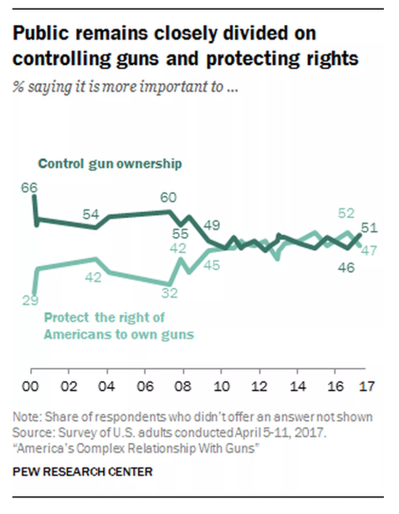

First Version: 
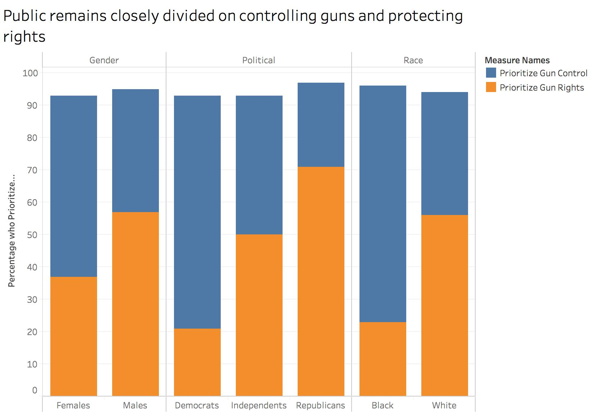

Revised Version:
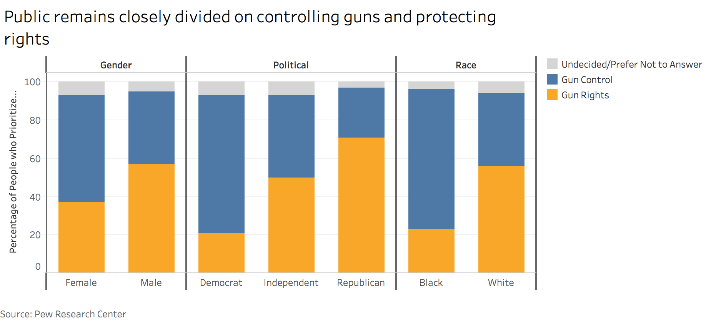

#### Critique of First Version
My first version had a few problems. Firstly, the totals of the stacked bar graph did not add up to 100%. This was one of the most common sources of confusion when I asked for feedback on this chart. Another critique was that the groups (i.e. Race, Political, Gender) were too difficult to distinguish from each other, and so the divisions at the heart of the argument were not readily visible.

In my first versions, I also thought a filter might be useful since there are several categories and subcategories present in the graph, not all necessarily of interest to every viewer (this will not show up in the picture, but should carry over to the Tableau Public Version. 

#### Additional Necessary Data Wrangling
Sources used in the first version:  http://www.people-press.org/2012/07/30/views-on-gun-laws-unchanged-after-aurora-shooting/ 
No additional data wrangling was necessary.

#### Tableau Revisions

To remedy the stacks not equalling 100%, I explicitly added the category "Undecided/Prefer Not to Answer" to fill the remainder of the survey respondents, and colored it a light gray so that it would not command attention. I left orange (a lighter orange than the default one for black and white printing) and blue colors for the other two groups because just as they represent opposite opinions, so too do they sit opposite each other on the color wheel. Another critique was that the groups were too difficult to distinguish from each other, so I decreased the size of the bars slightly to give a bit more space, and made the dividing lines thicker and darker, and bolded the category headers. I also added a filter for the different category, so that viewers could tailor the visualization to their interests. 

For polish, I changed the subcategories (e.g. female, male, democrat) to have the same plurality, deleted the unnecessary "Measure Names" title on the legend, and adjusted the legend category aliases and the y-axis title. I also added source information. 

#### Conclusion
I think my final revised version improved on the original chart in several ways. First of all, the original chart did not really even support the claim of the title; it showed time series data when the claim had nothing to do with change over time. My revised version clearly shows severe divisions across several social groupings, providing backing to the claim in the title. I think my chart not only supports the claim in its title to a much greater degree, but also is more informative and interesting that the original one.

### Chart #16 from Vox's gun violence article    
https://www.vox.com/policy-and-politics/2017/10/2/16399418/us-gun-violence-statistics-maps-charts

Original: 
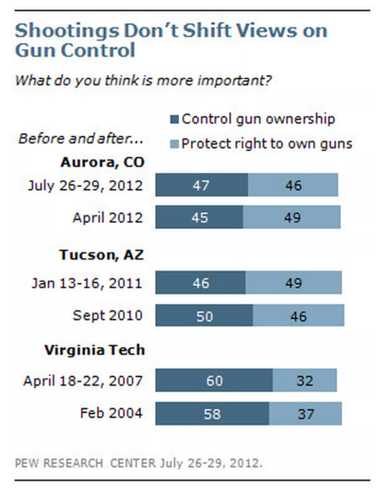

First Version: 
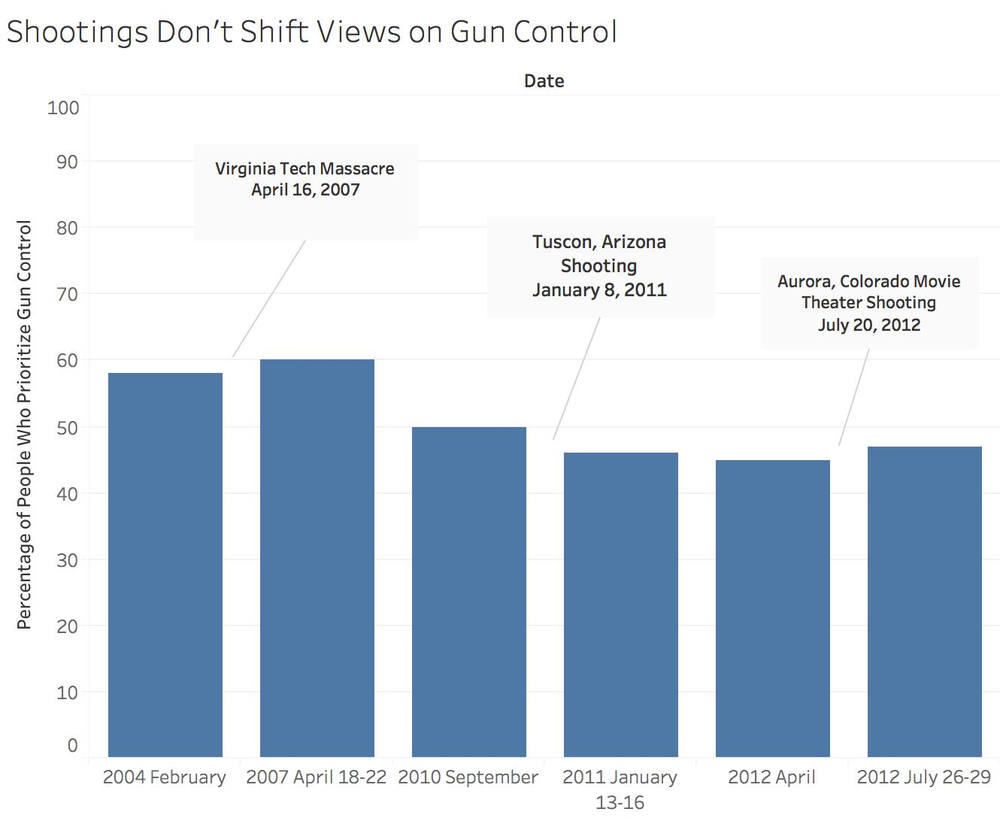

Revised Version:
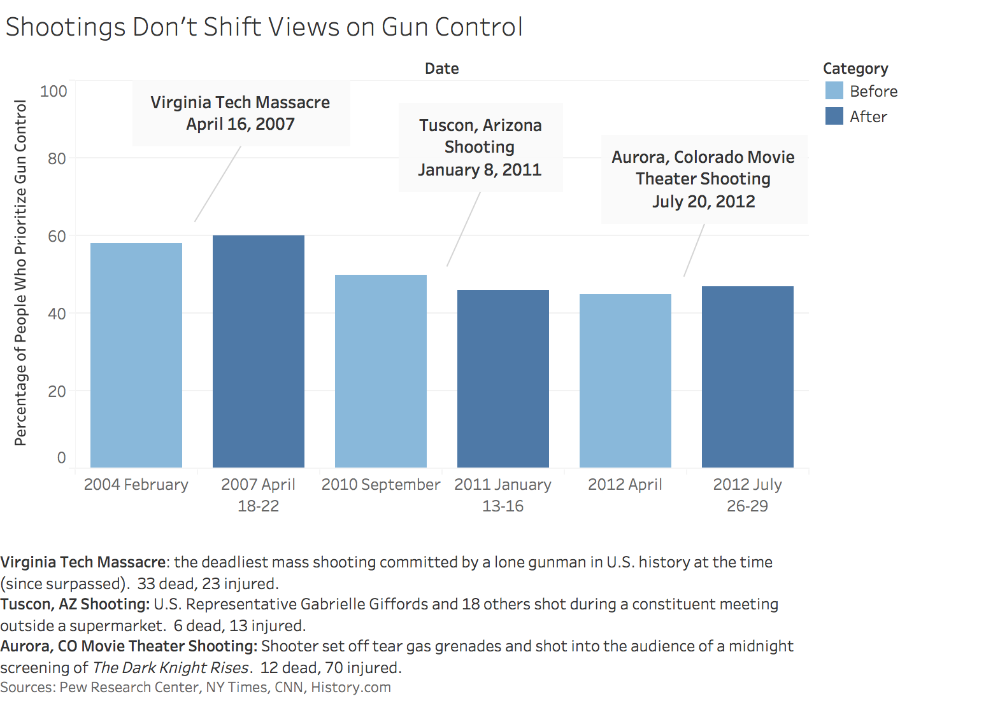

#### Critique of First Version
I thought my first version could be improved in several ways. First, I wanted to make obvious the before and after comparison.
Second, I wanted to provide a little bit of information about each shooting to help viewers remember or learn about why these mass shootings were remarkable (and horrible), so that it was even more interesting that they did not change people's opinions about gun control. I added it to the annotations on the graph first but it violated the "overview first, details on demand" principle and cluttered the chart visually as well, so I decided against it, and added a caption instead.
Furthermore, feedback from several people brought to my attention that the dates at the bottom of each bar are a bit cramped and running into each other.

#### Additional Necessary Data Wrangling
Sources used in the first version:
http://www.people-press.org/2012/07/30/views-on-gun-laws-unchanged-after-aurora-shooting/
No additional data wrangling was necessary, but I did use some additional sources for the descriptions of each shooting:
https://www.nytimes.com/2007/04/16/us/16cnd-shooting.html
http://news.blogs.cnn.com/2012/08/07/fast-facts-2011-tuscon-shooting/
https://www.history.com/this-day-in-history/12-people-killed-70-wounded-in-colorado-movie-theater-shooting

#### Tableau Revisions

I changed the colors of the bars to be different shades of blue, again so that the difference would show up in black and white printing, and sorted the legend so that "Before" comes above "After" for clarity. I also added a caption including information about each shooting, number of people dead, and number of people injured.

For polish, I added source information in the caption, and changed the formatting of the dates under each bar so that they were a bit more clearly separated.

#### Conclusion
I think my chart improved on the original for several reasons. The original chart was rather confusing, with dates presented out of chronological order, and with redundant information. My final revised version let form follow function, with the simplification of the original into a chronologically organized graph, with the integral before and after distinction emphasized. Furthermore, my revised version provides context, offering short descriptions on each mass shooting. I think my chart is concise, contextualized, and clear in its argument, where the original was cluttered, disconnected, and confusing.

## Deceptive Versions

### Chart #8 from Vox's gun violence article    
https://www.vox.com/policy-and-politics/2017/10/2/16399418/us-gun-violence-statistics-maps-charts

Original: 
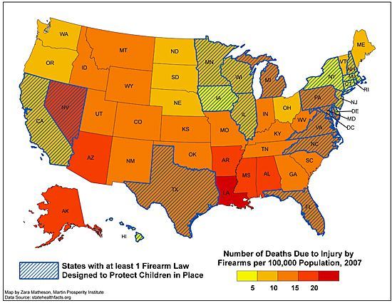

First Version: 
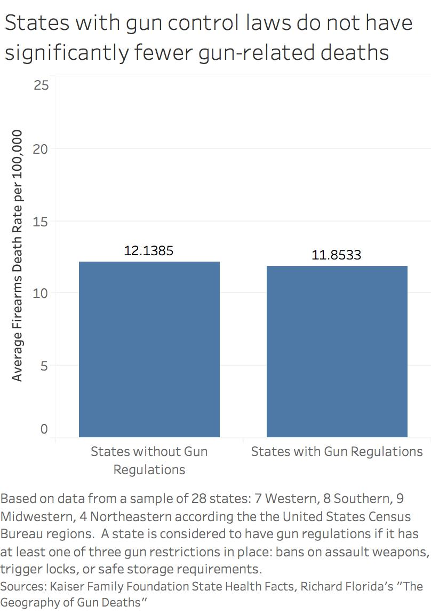

Revised Version:
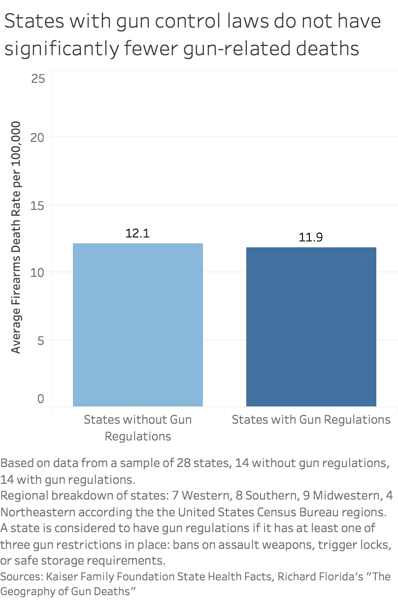

#### Critique of First Version
As I discussed in the future improvements of the first version, I wanted to include the information that I used an equal number of states with gun regulations and without. Like the additional information on regional breakdown, I wanted to include this information to give the appearance of a fair, representative sample of states for each category (which of course is not the case).
I also decided to give each category separate colors, again the two shades of blue to allow differentiation in black and white printing. I hoped the two different colors would make it more readily obvious that the two bars represent disparate categories, while the heights demonstrated the important similarity in firearms deaths.

I also thought there were two many decimal points in the mark labels, serving no other purpose than to distract.

#### Additional Necessary Data Wrangling
Sources used in the first version:
https://www.theatlantic.com/national/archive/2011/01/the-geography-of-gun-deaths/69354/
https://www.kff.org/other/state-indicator/firearms-death-rate-per-100000/?currentTimeframe=0&sortModel=%7B%22colId%22:%22Location%22,%22sort%22:%22asc%22%7D
(https://en.wikipedia.org/wiki/List_of_regions_of_the_United_States)
No additional data wrangling was necessary.

#### Tableau Revisions

I changed the colors of the two categories to be different shades of blue, again so that the difference would show up in black and white printing. I adjusted the caption to include the information about the number of states in each category, and reformatted the caption for better separation between topics.

For polish, I rounded the mark labels so that there is only one decimal point displayed.

#### Conclusion
I think my revised version does a good job of flipping the argument of the original, by focusing on the clear exceptions to the original argument that made a possible rebuttal easy, and hiding the deception in carefully cultivated facts (e.g. regional breakdown). It also improves on the original by specifying the gun restrictions on which the chart is based. 

### Chart #13 from Vox's gun violence article    
https://www.vox.com/policy-and-politics/2017/10/2/16399418/us-gun-violence-statistics-maps-charts

Original: 
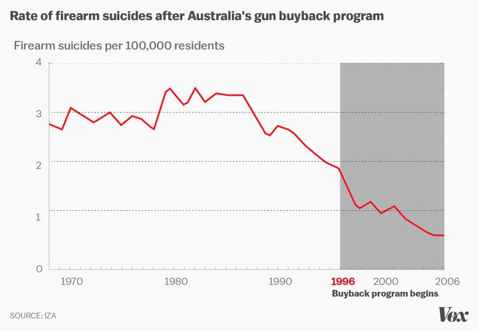

First Version: 
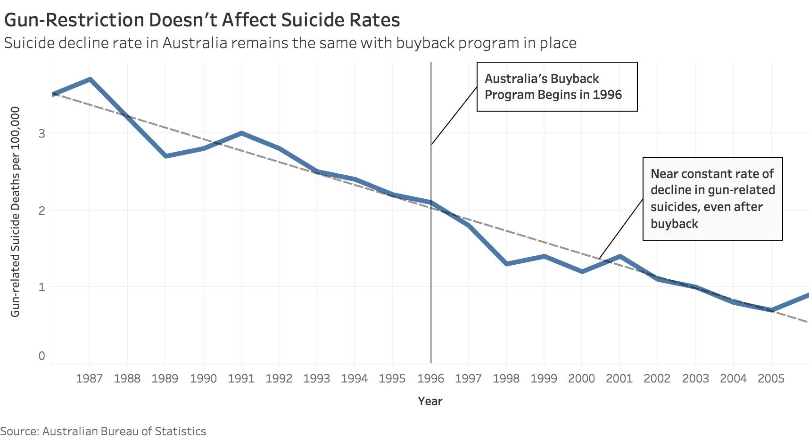

Revised Version:
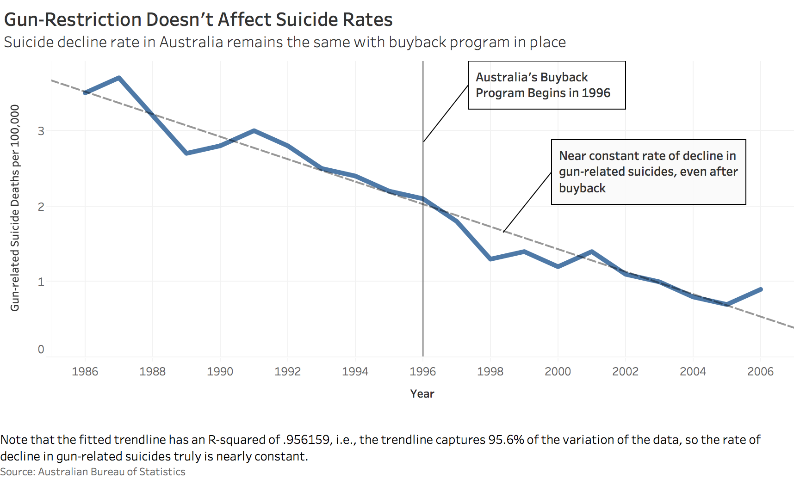

#### Critique of First Version
I had thought about removing the trendline in my first version to try to reduce any confusion, but I decided to explain it further instead. I discussed the R-squared value in the caption, which is a bit technical, but I included an explanation which summarizes the meaning of the R-squared value (The R-squared value will not be visible in a rollover on the picture, but will be on the Tableau Public version). I think the R-squared value makes the argument even stronger, since it confirms the constant rate of decline in firearm suicides.

Also as I discussed in my first version future improvements, I adjusted the placement of the trendline annotation to make it clearer that the annotation is for the trendline and not the actual data.

I also tried adding the corresponding data from gun-related homicides, but it was not as compelling in favor of the argument (a linear fit of that data had a much lower R-squared). Furthermore, the homicide rates were so much lower than the suicide rates that including them on the same chart did not make visual or logical sense.

#### Additional Necessary Data Wrangling
Sources used in the first version:
(https://docs.google.com/spreadsheets/d/1dIbOUd6uVnecoN4POu8X1G0L86YPMNVtaqPB__6Z5AY/edit#gid=1189303453)
No additional data wrangling was necessary for my final version but the homicide data I mentioned attempting to use can also be found in the above link.

#### Tableau Revisions

I added a statement to the caption about the R-squared value of the fitted trendline, and explained the meaning of the value and why it confirms the argument claimed in the graph.

For polish, I adjusted the position of the annotation of the trendline for clarity.

#### Conclusion
I think my chart does a good job of flipping the original argument by taking advantage of the flaws in the original chart. If you are looking closely, the data in the original chart does not even support the argument--suicides were already declining before the buyback was implemented, and my chart simply emphasizes this. 

### Chart #9 from Vox's gun violence article    
https://www.vox.com/policy-and-politics/2017/10/2/16399418/us-gun-violence-statistics-maps-charts

Original: 
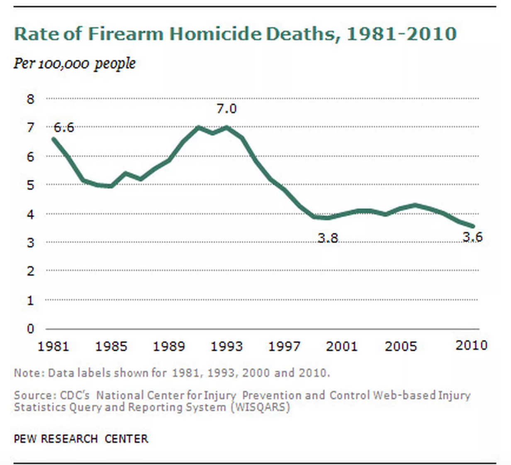

First Version: 

Revised Version:

#### Critique of First Version
My biggest problem with my first version was that it was a dual-axis graph with different scales, which is inherently deceptive, so my deceptive version was not that subtle. I attempted to plot percentage change instead of the absolutes to remedy this issue, but that version of the chart ended up being really visually confusing. So instead of changing the visual representation I added annotations to reinforce the changes in each line, and to try to compensate for the deceptive relativity of the dual-axis with some absolute numbers.

I also wanted to make it clear that this data was for the United States (especially since not all my graphs are based on data strictly in the United States).

#### Additional Necessary Data Wrangling
Sources used in the first version:
(https://fas.org/sgp/crs/misc/RL32842.pdf)
(http://www.thetruthaboutguns.com/2015/07/dean-weingarten/how-many-guns-are-there-in-america/)
No additional data wrangling was necessary.

#### Tableau Revisions

I added annotations to each line with the percentage increase or decrease in the measures depicted from the beginning to the end of the data shown.

I changed the title to add the United States distinction, and changed "and" to "While," because I thought it made the argument a bit stronger.

For polish, I changed the colors of the lines from the default Tableau colors to contrasting colors with enough difference in shade to be distinguishable in black and white printing. I also changed the endpoints on both y-axes to try to center the lines for aesthetic purposes.

#### Conclusion
I think my chart flips the argument of the original well for several reasons. The article presents a small description after the original chart explicitly saying that the decrease gun-related homicides is not due to increase in gun ownership, but did not elaborate on this or explain this in their chart. This allowed me to exploit that mistake and imply increase in gun ownership as a "causality, mechanism, explanation" for decrease in firearm homicides.
